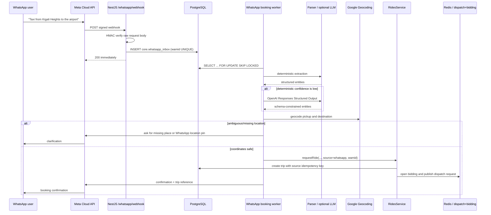

# Fida-Ride WhatsApp Booking Flow

## Runtime flow

## Security boundaries

- `GET /whatsapp/webhook` validates Meta's `hub.verify_token` handshake.
- `POST /whatsapp/webhook` validates `X-Hub-Signature-256` using HMAC-SHA256 over the exact raw HTTP body and the Meta App Secret.
- Legacy SHA-1 validation is disabled by default and can only be enabled explicitly.
- The webhook persists messages before acknowledging Meta. External LLM/geocoder/ride work never blocks the webhook response.
- `message_id` is unique in `core.whatsapp_inbox`, making Meta webhook retries safe.
- `core.trips(source_channel, source_request_id)` is unique, making ride creation idempotent if processing is retried after a partial failure.
- Only the message text is sent to the optional LLM. The webhook payload, access token, App Secret, and rider identifiers are not sent to the model. OpenAI storage is explicitly disabled (`store:false`).

## Clarification state

Incomplete conversation state is stored in Redis with a short TTL. A session contains only the current pickup/dropoff candidates, vehicle tier, and which endpoint is awaiting clarification. If Redis state expires, the bot safely asks the rider to restate the missing information rather than guessing.

Examples:

- `Take me to the office` -> no globally resolvable personal alias -> ask for pickup and a precise destination/location pin.
- `To the airport` -> retain destination, ask for pickup.
- User replies `Kigali Heights` while pickup is awaited -> treat it as the pickup candidate.
- User shares a WhatsApp location pin while pickup/dropoff is awaited -> use those coordinates directly and skip forward geocoding for that endpoint.

## Operational behavior

The worker uses PostgreSQL `FOR UPDATE SKIP LOCKED` so multiple NestJS replicas may process the inbox concurrently without handling the same row at the same time. A processing lease allows another replica to reclaim work after a crashed worker. Failures retry with bounded exponential backoff and eventually move to `failed` after the configured maximum attempts.
